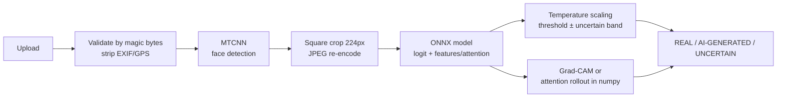

# DeepTrace — Explainable AI-Generated Face Detector

[](https://github.com/<YOUR_GITHUB_USERNAME>/deeptrace/actions/workflows/ci.yml)

Upload a photo → DeepTrace finds every face → for each one it returns **REAL / AI-GENERATED / UNCERTAIN**,
a **calibrated probability**, and a **heatmap** of the regions that drove the decision.

> **A detection aid, not proof.** Detectors like this one are known to be weaker on images from newer
> generators and on compressed or re-uploaded photos. Never use a result as the sole basis for an
> accusation.

The project focuses on **honest evaluation**: a shortcut-learning audit before training, a
cross-generator test set that the model never sees, robustness curves, calibration, a pre-registered
model-selection rule, and heatmaps that are parity-tested against autograd.

<!-- Screenshot: add docs/screenshots/analyze.png after deploying the trained model -->

---

## Results

> **Status: `TBD`.** Every number below comes from `ml/reports/*.json` produced by the Kaggle notebooks
> and rendered by `ml/scripts/render_metrics_md.py`. Nothing is typed by hand. Full tables:
> [`docs/METRICS.md`](docs/METRICS.md).

| Model | ID test ROC-AUC (StyleGAN) | Cross-generator ROC-AUC (diffusion) | Own-photo set ROC-AUC | CPU p95 latency (model + heatmap) |
|---|---|---|---|---|
| EfficientNet-B0 (fine-tuned) | TBD | TBD | TBD | TBD |
| ConvNeXt-Tiny (fine-tuned) | TBD | TBD | TBD | TBD |
| CLIP ViT-B/16 (frozen + linear probe) | TBD | TBD | TBD | TBD |

| Shortcut audit (metadata-only classifier, ROC-AUC) | Raw data | After canonical preprocessing |
|---|---|---|
| 140k Real and Fake Faces | TBD | TBD |

**Selected deployment model:** TBD, chosen by the rule in [ARCHITECTURE §5.0](docs/ARCHITECTURE.md): highest
cross-generator AUC among models within 0.03 ID-AUC of the best and under the CPU latency budget.

Plots: calibration & ROC in `docs/plots/eval/`, robustness curves in `docs/plots/robustness/`, heatmap
galleries in `docs/plots/explain/`, spectra in `docs/plots/fft/`. Interpretation:
[`docs/EXPLAINABILITY.md`](docs/EXPLAINABILITY.md).

---

## How it works



| Stage | What | Why |
|---|---|---|
| Shortcut audit | Trivial classifiers on file metadata and pixel statistics, spectra, before/after preprocessing | Prove the model can't win with "PNG = fake" or "has EXIF = real" |
| Canonical preprocessing | Same MTCNN crop, 224 px, JPEG re-encode and metadata stripping for every image | Removes compression and format fingerprints; identical code in training and serving |
| Leakage control | pHash + dHash near-duplicate removal across splits; `val_select` vs `val_calib` | Test numbers measure generalisation, not memorisation or double-dipping |
| Models | EfficientNet-B0, ConvNeXt-Tiny, frozen CLIP ViT-B/16 probe (ViT-S optional) | Compare full fine-tuning against frozen general-purpose features on unseen generators |
| Training | AdamW, warmup + cosine, AMP, early stopping on val AUC, JPEG/blur/downscale augmentation, fixed seeds | Standard, reproducible fine-tuning that doesn't depend on pristine artifacts |
| Evaluation | ID, cross-generator (full, fake-only swap, real-only swap), own photos; bootstrap 95% CIs | Separates "new generator" from "new real-photo source" when accuracy drops |
| Robustness | JPEG 100→30, downscaling, blur, screenshot chains, through the serving pipeline | Real uploads are degraded |
| Calibration | Temperature scaling; threshold capped at 5% false-positive rate; uncertain band | Wrongly flagging a real photo is the costly error |
| Explainability | Grad-CAM/Grad-CAM++, ViT Grad-CAM + attention rollout, randomisation sanity check, FFT | Show where the model looks and when those heatmaps can't be trusted |
| Serving | ONNX Runtime; heatmaps computed from ONNX outputs (no autograd) | Fast CPU inference on free hosting; exactness verified at export |

Full design: [`docs/ARCHITECTURE.md`](docs/ARCHITECTURE.md).

---

## Quickstart

### A. Full stack with Docker (React + FastAPI + PostgreSQL)

```bash
cp .env.example .env            # set POSTGRES_PASSWORD and DEEPTRACE_JWT_SECRET
docker compose up --build       # http://localhost:8080
```

The API loads the bundle from `./models/current`, or downloads it from `DEEPTRACE_MODEL_REPO_ID` on the
Hugging Face Hub. Without a model, `/api/v1/health` reports `degraded` with the reason.

### B. Development mode

```bash
# API (see backend/README.md for the full install)
cd backend && uvicorn app.main:create_app --factory --port 8000
# UI (proxies /api to 127.0.0.1:8000)
cd frontend && npm ci && npm run dev
```

### C. Reproduce the ML pipeline (free Kaggle GPU)

| Order | Notebook | Produces |
|---|---|---|
| 0 | `ml/notebooks/00_generate_diffusion_faces.ipynb` | SDXL + FLUX.1-schnell test faces |
| 1 | `ml/notebooks/01_data_prep_and_audit.ipynb` | Manifests, dedupe, processed crops, shortcut audit |
| 2 | `ml/notebooks/02_train_and_evaluate.ipynb` (per model) | Checkpoints, calibration, test-set metrics |
| 3 | `ml/notebooks/03_robustness_explain_export.ipynb` | Robustness, galleries, FFT, ONNX bundles, latency, model selection, `docs/METRICS.md` |

Details and CLI equivalents: [`ml/README.md`](ml/README.md).

### D. Deploy (free)

1. Upload the selected bundle: `python ml/scripts/upload_model_to_hub.py --bundle-dir artifacts/<model> --repo-id <user>/deeptrace-model`
2. Create a **Docker** Space on Hugging Face and set Space variables `DEEPTRACE_MODEL_REPO_ID` and
   `DEEPTRACE_MODEL_REVISION` (pin a commit).
3. Add the `HF_TOKEN` secret to the GitHub repo and run the **Deploy to Hugging Face Spaces** workflow.

The Space runs `Dockerfile.spaces`: one container serving the API and the built UI, with history
disabled (no database).

---

## Repository structure

```
deeptrace/
├── ml/          data audit, preprocessing, training, evaluation, explainability, ONNX export, serving runtime
├── backend/     FastAPI app (api/, services/, inference/, db/) + tests
├── frontend/    React + Vite + Tailwind UI (upload, face boxes, heatmap slider, model card, history)
├── docs/        ARCHITECTURE.md, METRICS.md (generated), EXPLAINABILITY.md, plots/
├── deploy/      Hugging Face Space README
├── .github/     CI (lint, tests, Docker builds) + Spaces deploy workflow
├── docker-compose.yml
└── Dockerfile.spaces
```

## Testing

| Component | Tests | Highlights |
|---|---|---|
| `ml/` | 68 (pytest) | Numpy Grad-CAM matches autograd for EfficientNet and ConvNeXt heads; ONNX export; dedupe vs brute force; JPEG quality estimation; EXIF stripping; calibration and audit logic |
| `backend/` | 29 (pytest) | Real ONNX Runtime on a tiny generated model; error envelope; rate limiting; checksum tampering; auth; users can't see each other's history; privacy default stores nothing |
| `frontend/` | 22 (Vitest + Testing Library) | Upload flow, error messages, probability meter, heatmap opacity slider, API client |

Beyond unit tests, the full pipeline was run end-to-end on a synthetic dataset (train → calibrate →
evaluate → robustness → explain → export → benchmark → select). The API and UI were exercised with a
real photo and real MTCNN, in both the two-service layout and the single-container Spaces layout.

---

## Known limitations

- **Generalisation.** Training fakes are StyleGAN only, so diffusion-model faces are expected to be
  harder. The cross-generator results quantify how much.
- **Degraded images.** Heavy compression, downscaling, blur and screenshots reduce accuracy (see the
  robustness curves).
- **Calibration drift.** Probabilities are calibrated on StyleGAN-era validation data and are less
  reliable for other generators.
- **Scope.** Not designed for face swaps, partial edits/inpainting, video, or non-photographic images.
- **Real-source confound.** CelebA-HQ "real" images went through neural super-resolution when the
  dataset was made, which can inflate false positives on that set.
- **Fairness.** Performance across age, skin tone and camera types has not been audited with
  demographic labels.
- **Adversarial robustness** is not addressed: a motivated person can evade detection.
- **Heatmaps** are coarse (7×7 or 14×14 grids) and show where evidence was, not why. Attention
  rollout is class-agnostic.

## Ethics & responsible use

- **Not proof.** The UI, the API responses and the model card all say so. A "likely AI-generated"
  result is a reason to check the source and context, not a verdict about a person.
- **Asymmetric errors.** The threshold limits false positives on real photos (target 5%), because
  wrongly accusing someone of faking a photo is the more harmful mistake. Borderline scores are
  reported as UNCERTAIN.
- **Privacy by default.** Uploads are processed in memory and discarded. Saving is opt-in, requires an
  account, stores only a metadata-stripped copy, and expires automatically. Users can delete any item.
- **Consent.** The own-photo test set should only contain people who agreed to be photographed for it;
  it is never committed or published.

## Datasets & licenses

| Data / model | Use here | License (verify before any reuse) |
|---|---|---|
| 140k Real and Fake Faces (Kaggle): FFHQ reals, StyleGAN fakes | Train / validation / ID test | FFHQ: CC BY-NC-SA 4.0 (non-commercial) |
| CelebA-HQ | Cross-generator real test images | Non-commercial research only |
| SDXL base 1.0 | Generating test fakes | CreativeML Open RAIL++-M |
| FLUX.1 [schnell] | Generating test fakes | Apache-2.0 |
| DiFF (if access granted) | Cross-generator test | Research use by application |
| timm / OpenAI CLIP weights | Backbones | Apache-2.0 / MIT |

Because of FFHQ's license, trained DeepTrace models are for **non-commercial** use.

---

## Resume bullets

Replace `[X]` with numbers from `docs/METRICS.md` after the runs. Don't round in your favour.

- Built **DeepTrace**, an explainable AI-generated face detector (PyTorch, timm, ONNX Runtime, FastAPI,
  React), comparing fine-tuned EfficientNet-B0/ConvNeXt-Tiny against a frozen CLIP ViT-B/16 probe on
  140k faces; selected the deployment model with a pre-registered cross-generator criterion.
- Designed a leakage-controlled evaluation: shortcut audit (metadata-only classifier AUC [X] → [X] after
  preprocessing), perceptual-hash dedupe, and a held-out diffusion test set (SDXL/FLUX) on which ROC-AUC
  dropped from [X] to [X]. The drop is attributed via generator-only vs real-source-only swaps.
- Implemented temperature scaling (ECE [X] → [X]), an FPR-capped decision threshold with an uncertainty
  band, bootstrap 95% CIs, and robustness curves for JPEG, downscaling, blur and screenshot degradation.
- Derived closed-form Grad-CAM for GAP-head CNNs and ONNX attention rollout for ViTs, enabling
  PyTorch-free heatmaps at [X] ms p95 on 2 CPU threads; parity against autograd is enforced at export.
- Shipped a privacy-by-default web app (FastAPI + PostgreSQL + React/Tailwind) with JWT auth, opt-in
  history with retention, rate limiting, 119 automated tests, Docker, GitHub Actions CI, and a free
  Hugging Face Spaces deployment.

## References

- Wang et al., *CNN-generated images are surprisingly easy to spot… for now*, CVPR 2020
- Ojha et al., *Towards Universal Fake Image Detectors that Generalize Across Generative Models*, CVPR 2023
- Selvaraju et al., *Grad-CAM*, ICCV 2017 · Chattopadhay et al., *Grad-CAM++*, WACV 2018
- Abnar & Zuidema, *Quantifying Attention Flow in Transformers*, ACL 2020
- Adebayo et al., *Sanity Checks for Saliency Maps*, NeurIPS 2018
- Guo et al., *On Calibration of Modern Neural Networks*, ICML 2017
- Frank et al., *Leveraging Frequency Analysis for Deep Fake Image Recognition*, ICML 2020
- Karras et al., *Progressive Growing of GANs* (CelebA-HQ), ICLR 2018 · *A Style-Based Generator* (FFHQ/StyleGAN), CVPR 2019
