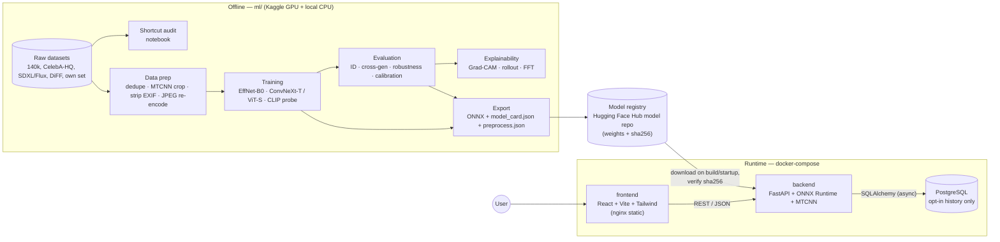
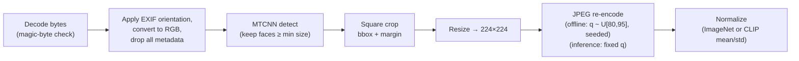
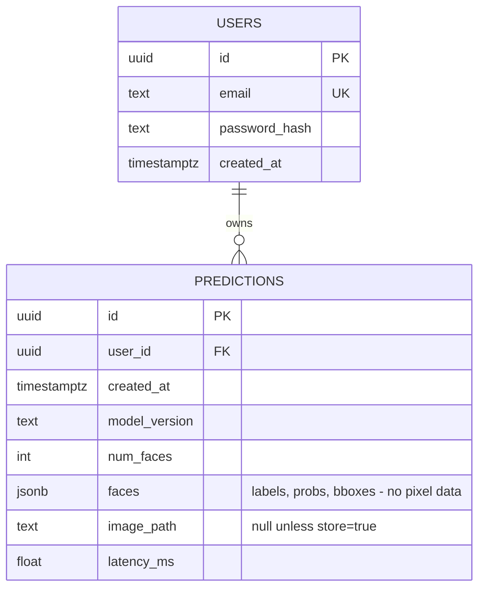

# DeepTrace — Architecture & Evaluation Plan

> **Status:** All 10 phases implemented and tested on synthetic data (see the README). The GPU runs
> on real data (Kaggle notebooks 00–03) are still to be executed, so every result table is `TBD`.
> Sections below describe the design; "Implementation notes" mark where the build refined it.
> **Metrics policy:** every number in this repo's results tables stays `TBD` until it comes out of an
> actual training/evaluation run and is backed by a JSON file in `ml/reports/`. Numbers in this
> document are **config values or targets**, never results.

---

## 1. What we are building

A user uploads a photo → DeepTrace finds every face → for each face it returns
**REAL / AI-GENERATED / UNCERTAIN**, a **calibrated probability**, and a **Grad-CAM heatmap**
showing which regions drove the decision.

### Goals
1. Honest, reproducible deep learning: shortcut audit → fine-tuning → rigorous evaluation that
   shows where the model **fails** (new generators, compression, resizing).
2. Explanations a non-expert can look at, plus an honest written interpretation of them.
3. A production-shaped app: typed API, tests, Docker, CI, privacy-by-default.

### Non-goals
- Not a forensic tool, not proof. The UI and API always carry a disclaimer.
- No video deepfake detection, no face-swap/reenactment-specific detection (out of scope; noted as a limitation).
- No claim of generalization to generators we did not test.

---

## 2. System overview



**Key idea:** the `ml/` side produces three artifacts that are the *only* contract with the backend:

| Artifact | Contents | Why it exists |
|---|---|---|
| `model.onnx` | Network with **two outputs**: `logit` plus `features` (CNN: last feature map) or `attentions` (ViT: per-block attention) | Fast CPU inference **and** heatmaps without PyTorch autograd (see §7.3) |
| `preprocess.json` | Crop margin, resize size & interpolation, JPEG quality, mean/std | One source of truth → prevents train/serve skew |
| `model_card.json` | Model name/version, temperature, threshold, uncertainty band, head weights, **metrics copied from eval JSON** | `/model-info` and the Model Info page read this; metrics are never hand-typed into UI code |

---

## 3. Datasets

| # | Set | Real source | Fake source | Used for | License notes (verify before release) |
|---|---|---|---|---|---|
| D1 | Kaggle *140k Real and Fake Faces* | FFHQ (70k) | StyleGAN (70k) | train / val / **ID test** | FFHQ compilation: CC BY-NC-SA 4.0 (NVIDIA), images under individual Flickr licenses → **non-commercial**. Check the Kaggle page for the fake-image source license. |
| D2 | Cross-generator test | CelebA-HQ subset (~1–2k) | SDXL + FLUX.1 generated (~1–2k), DiFF subset if access granted | **test only** | CelebA/CelebA-HQ: non-commercial research only. SDXL: CreativeML Open RAIL++-M. FLUX.1 [schnell]: Apache-2.0; FLUX.1 [dev]: non-commercial license. DiFF: research access by application. |
| D3 | Own sanity set | ~100 phone photos | ~100 self-generated | **test only** | Only photograph people who consent; don't publish their photos in the repo/demo. |

### 3.1 Split discipline

```
D1 train (100k) ──► fit weights
D1 valid (20k)  ──► split deterministically (seeded, stratified) into:
                     ├─ val-select (10k): early stopping + model selection
                     └─ val-calib  (10k): temperature scaling + threshold + uncertainty band
D1 test  (20k)  ──► in-distribution test, touched once per final model
D2, D3          ──► never used for any fitting or tuning decision
```

**Why split validation in two:** if the same images choose the epoch *and* fit temperature/threshold,
the calibration looks better than it really is (it's been optimized twice on the same data).
Keeping `val-calib` separate costs nothing with 20k images and makes the calibration numbers honest.

### 3.2 Leakage & duplicate checks (Phase 2)
- **Perceptual-hash (pHash) dedupe across all splits and datasets**; near-duplicates across splits are
  removed from the *test* side and counted in the report.
- Dataset manifest (`ml/data/manifests/*.csv`): `path, sha256, source, label, split, width, height, format, jpeg_quality_est, has_exif`.
- **CelebA-HQ caveat:** CelebA-HQ was built from CelebA with a neural JPEG-artifact-removal and 4×
  super-resolution network (Karras et al., 2018). Its "real" images therefore carry neural-network
  processing traces, which a fake detector may legitimately react to. Real-face false positives on
  CelebA-HQ are reported with this caveat, and the own-photo set (D3) serves as an unprocessed real
  source.
- Cross-generator caveat, built into the evaluation design: D2 changes **both** the fake source
  (diffusion) *and* the real source (CelebA-HQ). A metric drop could come from either. We therefore
  report **per-source rates** (TNR on each real source, TPR on each fake source) — see §6.2.

---

## 4. Shortcut-learning audit (Phase 2, before any training)

A classifier will happily learn "PNG = fake" or "has EXIF = real" instead of learning faces.
The audit measures every cheap signal per class and source, then preprocessing removes them.

| Signal | How measured | Plot |
|---|---|---|
| Resolution / aspect ratio | Pillow header | histogram per class |
| File format | magic bytes (not extension) | bar chart |
| JPEG quality | quantization-table estimate | histogram |
| File size / bits-per-pixel | `os.stat` / pixels | KDE |
| Color statistics | per-channel mean/std, saturation, brightness | KDE |
| EXIF presence & fields | `PIL.Image.getexif()` | bar chart |
| Face size in frame | MTCNN bbox area / image area | histogram |
| Spectrum | azimuthally averaged log-power FFT | line plot |

**"Trivial classifier" test:** train a logistic regression on *only* the metadata features above.
If it gets well above chance on D1, those shortcuts exist in the raw data. We rerun it **after**
preprocessing — the goal is near-chance performance. (Result: `TBD`.)

### 4.1 Canonical preprocessing (identical for both classes, all datasets, and inference)



- **Why re-encode everything as JPEG:** FFHQ reals are PNG-derived while generated images often have
  different compression histories; re-encoding both classes into the same quality range removes
  "compression fingerprint = label". A random-but-seeded quality range (rather than one fixed value)
  also prevents the model from keying on one exact quantization table.
- **Why MTCNN on already-cropped faces:** D1 is pre-aligned, but uploaded photos are not. Running the
  same detector + crop rule on training data guarantees the model sees faces framed exactly as it
  will at inference. Images where MTCNN finds no face are **dropped and counted**, not silently
  passed through uncropped.
- Exact values (margin, interpolation, inference JPEG quality) are fixed in `ml/configs/preprocess.yaml`
  in Phase 2 and exported to `preprocess.json`. A **parity test** in CI runs golden images through
  the ml and backend pipelines and asserts identical tensors (tolerance `1e-5`).

---

## 5. Models & training

| Model | Params (approx.) | Role | Why |
|---|---|---|---|
| EfficientNet-B0 (timm, ImageNet) | 5.3M | Baseline | Small, fast on CPU, strong transfer; the "does the pipeline work" model. |
| ConvNeXt-Tiny (timm, ImageNet) | 28M | Stronger CNN | Modern CNN with ViT-style training recipes; keeps the exact Grad-CAM path of CNNs (§7). |
| CLIP ViT-B/16 (OpenAI weights via timm/open_clip), **frozen** + logistic-regression probe | 86M frozen + ~770 trainable | **Core model, likely deployment candidate** | Published work (e.g. UnivFD, Ojha et al. 2023) found frozen CLIP features transfer across generators much better than full fine-tuning, which tends to overfit one generator's artifacts. Since modern diffusion faces are the real-world threat, generalization matters more than StyleGAN accuracy. We test that claim ourselves. |
| ViT-Small/16 (timm) | 22M | Optional transformer comparison | Global attention may catch inconsistencies CNNs miss; run only if GPU quota remains after the three core models. |

All models, weights and libraries above are free and open (MIT / Apache-2.0).

### 5.0 How the "best model" is chosen (decided now, before seeing results)
"Best" is decided by a rule written down **before** training, so we can't pick whichever number looks
nicest afterwards:

1. **Eligible:** ID test ROC-AUC within 3 points of the top model **and** CPU p95 latency under the
   budget in §7.2 on the free Hugging Face Spaces CPU.
2. **Winner:** highest **cross-generator ROC-AUC** (fake-only-swap sets, averaged over SDXL/FLUX/DiFF).
3. **Tie (within the bootstrap CI):** the smaller/faster model.

Why this rule: a detector that's excellent on StyleGAN but guesses on diffusion faces is useless for
real uploads in 2026. My expectation is that the CLIP probe wins, but that's a hypothesis — the
Phase 5 numbers decide.

### 5.0.1 Free compute plan
| Job | Where (free) | Why |
|---|---|---|
| Training & evaluation | **Kaggle Notebooks** (T4×2 or P100, weekly GPU quota) | Kaggle hosts the 140k dataset directly (no 4 GB download), sessions run longer and are steadier than free Colab. Notebooks are written to also run on free Colab. |
| Diffusion face generation | Kaggle GPU: **SDXL** (fp16) and **FLUX.1 [schnell]** (Apache-2.0, 4-step, quantized/offloaded to fit 16 GB) | Both free and open; schnell's permissive license avoids the FLUX.1 [dev] non-commercial terms. |
| Audit, ONNX export, latency benchmark | Your local CPU | No GPU needed. |
| Public demo | **Hugging Face Spaces** free CPU (Docker) | Free, no cold-start billing, weights live in a free HF model repo. |

### 5.1 Training recipe (starting config — tuned only on `val-select`)

| Choice | Starting value | Why |
|---|---|---|
| Loss | `BCEWithLogitsLoss` (1 logit) | Binary task; a single logit makes temperature scaling and thresholds simple. |
| Optimizer | AdamW, wd 0.05 | Decoupled weight decay is the standard for fine-tuning ConvNeXt/ViT. |
| LR | head 1e-3, backbone 1e-4 (EffNet) / 5e-5 (ViT, ConvNeXt) | Pretrained features need smaller steps than a fresh head, or they get destroyed early. |
| Schedule | Linear warmup 1 epoch → cosine decay | Warmup avoids large, noisy updates to pretrained weights while the head is still random. |
| Precision | AMP (fp16 on T4/P100) | ~2× faster, fits bigger batches in 16 GB. |
| Batch / epochs | 64 / max 15 | Placeholder; set by Kaggle GPU memory and weekly quota in Phase 3. |
| CLIP probe | Extract features once, cache to disk, fit logistic regression (C tuned on val-select) | The backbone is frozen, so features only need computing once — minutes of GPU instead of hours. |
| Early stopping | patience 3 on **val-select ROC-AUC** | AUC is threshold-free, so stopping doesn't depend on a threshold we haven't tuned yet. |
| Seeds | `torch`, `numpy`, `random`, dataloader workers, split generation | Reproducibility; we also run **3 seeds** of the final config and report mean ± std. |

### 5.2 Augmentations (albumentations, train only)

| Augmentation | Purpose |
|---|---|
| RandomJPEG q∈[30,100] | Robustness to re-uploads; stops reliance on pristine high-frequency artifacts. |
| GaussianBlur σ∈[0,2] (p=0.2) | Same — blur kills the fine textures GAN detectors love. |
| Downscale 0.25–1.0 then back up (p=0.3) | Simulates thumbnails / social-media resizing. |
| ColorJitter (mild) | Removes color-statistics shortcuts. |
| HorizontalFlip | Faces are roughly symmetric; free data. |

**Trade-off we will measure:** heavy degradation augmentations usually cost a little in-distribution
accuracy and buy robustness. Phase 5 robustness curves show whether that trade was worth it.

### 5.3 Experiment tracking
Structured JSON per run (works on Colab with no server; diffable in git):
`ml/runs/<run_id>/{config.yaml, env.json (pip freeze, CUDA, GPU, git SHA), metrics_epoch.jsonl, final_metrics.json, checkpoint.sha256}`.
MLflow file-store logging is an optional add-on reading the same values.

---

## 6. Evaluation plan

Everything is written by scripts to `ml/reports/*.json`; plots and README tables are generated from
those files. **95% confidence intervals via bootstrap (1,000 resamples)** for AUC, accuracy, F1.

### 6.1 Metric suite (applied to every test set)
Accuracy, precision, recall, F1, ROC-AUC, PR-AUC, confusion matrix, **TPR @ FPR=5%**, ECE (15 bins),
Brier score.

**Class convention:** positive = AI-generated. A **false positive = a real person's photo called fake**,
which is the harmful error (false accusation), so the operating threshold is chosen with that in mind (§6.5).

### 6.2 Test sets & result tables (all `TBD`)

| Test set | Real source | Fake source | Question it answers |
|---|---|---|---|
| ID | FFHQ (D1 test) | StyleGAN (D1 test) | Did the model learn the training task? |
| Cross-gen: full | CelebA-HQ | SDXL + FLUX (+ DiFF) | Does it work on modern generators + new real source? |
| Cross-gen: fake-only swap | FFHQ (D1 test) | SDXL / FLUX / DiFF, **each separately** | Isolates the **generator** shift |
| Cross-gen: real-only swap | CelebA-HQ | StyleGAN (D1 test) | Isolates the **real-source** shift |
| Own set | Phone photos | Self-generated | Real-world sanity check (small n → wide CIs, reported as such) |

The expected big drop on diffusion faces will be analyzed, not hidden: GAN detectors typically latch
onto upsampling artifacts (periodic spectral peaks) that diffusion models don't produce in the same
way — the FFT analysis (§8.3) is the evidence we'll check for this.

### 6.3 Robustness (on ID test and cross-gen full)

| Perturbation | Grid |
|---|---|
| JPEG quality | 100, 90, 80, 70, 60, 50, 40, 30 |
| Downscale → upscale back | 1.0, 0.75, 0.5, 0.35, 0.25 |
| Gaussian blur σ | 0, 0.5, 1, 1.5, 2, 3 |
| Screenshot / re-upload chain | random display scale (0.5–1.5) → PNG → gamma jitter → resize → JPEG q 70–90 (seeded, ×3 chains) |

Output: accuracy + AUC vs severity curves, one line per model, on the same axes.
Perturbations are applied to the **original image before** face cropping, the way real-world
degradation happens.

### 6.4 Calibration
- Reliability diagram before/after **temperature scaling** (one scalar `T` fitted on `val-calib` by
  minimizing NLL). Why: fine-tuned networks are usually over-confident; `T` fixes the probability
  scale without changing the ranking (AUC unchanged).
- ECE reported on ID **and** cross-gen — calibration fitted on StyleGAN is expected to degrade on
  diffusion images, and we'll say so.

### 6.5 Threshold & uncertainty band (fitted on `val-calib`, after temperature)
- **Threshold `t`:** the lowest threshold that keeps **FPR ≤ 5%** on real faces (configurable), with
  Youden's J reported alongside for comparison. Why: blindly using 0.5 ignores the asymmetric cost of
  accusing a real photo of being fake.
- **Uncertainty band `[t−δ, t+δ]`:** predictions inside return `UNCERTAIN`. `δ` is chosen so the band
  captures a target share of validation errors while abstaining on a bounded share of images; we
  report the resulting **coverage vs accuracy-on-covered** curve.

### 6.6 Error analysis
Top-N most confident false positives and false negatives per test set, saved as a gallery:
original | crop | heatmap | calibrated p | source dataset. Each gallery gets a short written note
of observed patterns (e.g. heavy makeup, extreme lighting, low resolution, glasses).

---

## 7. Inference design (backend)

### 7.1 Request flow

```mermaid
sequenceDiagram
    autonumber
    participant U as Browser (React)
    participant A as FastAPI /predict
    participant V as Validation
    participant F as Face detector (MTCNN)
    participant M as ONNX Runtime
    participant X as Explainer (numpy CAM)
    participant D as PostgreSQL

    U->>A: POST multipart image (store=false default)
    A->>A: Rate limit check (per IP)
    A->>V: size ≤ 10 MB, magic bytes ∈ {JPEG, PNG, WebP}, max pixels, decode
    alt invalid
        V-->>U: 413 / 415 / 422 error envelope
    end
    V->>F: RGB image (EXIF-oriented, metadata dropped)
    F-->>A: 0..N boxes
    alt no face
        A-->>U: 422 NO_FACE_DETECTED
    end
    loop each face (cap: 10)
        A->>A: crop + resize + JPEG q + normalize (preprocess.json)
        A->>M: tensor 1×3×224×224
        M-->>A: logit, feature map
        A->>A: p = sigmoid(logit / T), label via t ± δ
        A->>X: feature map + head weights
        X-->>A: heatmap → colorized PNG (base64)
    end
    opt store=true AND logged in
        A->>D: insert prediction row (+ image path)
    end
    A-->>U: 200 JSON (faces[], model version, timings, disclaimer)
    Note over A: Uploaded bytes live only in memory; discarded after response when store=false
```

### 7.2 Why ONNX Runtime
Serving a PyTorch checkpoint drags in autograd and is slower on CPU; ONNX Runtime typically runs
the same graph faster with a smaller memory footprint, which matters on free-tier hosting. We
benchmark PyTorch-CPU vs ONNX-CPU (p50/p95 latency, 100 warm runs) in Phase 6 — **target** (not a
result): < 500 ms p95 per single-face image on a 2-vCPU container.

### 7.3 Heatmaps without autograd (the non-obvious part)
ONNX Runtime can't compute gradients, but Grad-CAM needs them. For CNNs whose head is
**global average pooling → (optional norm) → linear**, the gradient of the logit w.r.t. each
spatial position of the last feature map is the same everywhere (pooling spreads it evenly), so
Grad-CAM collapses to a closed form:

`heatmap = ReLU( Σ_k g_k · A_k )`, where `A` = feature map and `g` = ∂logit/∂(pooled features).

- EfficientNet-B0: `g` = linear head weights (a constant) → exactly classic CAM.
- ConvNeXt-Tiny: head has a LayerNorm after pooling → `g` is the LayerNorm Jacobian times the weights, computed in ~5 lines of numpy.

So `model.onnx` exports both `logit` and `features`, `model_card.json` holds the head parameters,
and a **Phase 6 parity test** checks our numpy heatmaps against `pytorch-grad-cam` (tolerance
defined there). Grad-CAM++ is kept for offline analysis in notebooks.
**ViT / CLIP models** (CLS-token head, no spatial pooling → the shortcut doesn't apply).
*Implementation note:* instead of a PyTorch fallback, the ONNX export adds a second output with the
head-averaged attention matrices of every block, and the backend computes **attention rollout** in
numpy. The serving path therefore stays PyTorch-free for every model family; the trade-off is that
rollout is class-agnostic (§8.2), which the UI explains. Grad-CAM for ViTs remains available offline.

*Verification (implemented):* `export_model.py` refuses to write a bundle unless ONNX Runtime matches
PyTorch (max abs diff ≤ 1e-3) and the numpy heatmap matches an autograd reference. CNN maps are
compared **before** the ReLU so an all-negative map cannot make the check pass vacuously.

### 7.4 Face detection
`facenet-pytorch` MTCNN in both training prep and backend, so crops match. Cost: CPU-only PyTorch
in the backend image (installed from the CPU wheel index to avoid CUDA bloat). Swapping to a lighter
ONNX detector later is allowed **only** if the training data is re-cropped with it too.

---

## 8. Explainability plan (Phase 6)

### 8.1 CNNs — Grad-CAM and Grad-CAM++
Target layer = last conv stage (EffNet `conv_head` activations; ConvNeXt `stages[-1]`).
Grad-CAM weights feature maps by averaged gradients; Grad-CAM++ uses higher-order gradient terms,
which helps when several separate regions contribute (e.g. both eyes and teeth).

### 8.2 ViT — Grad-CAM with `reshape_transform` vs attention rollout
- **Grad-CAM for ViT:** take token outputs of a late block (`blocks[-1].norm1`), drop the CLS token,
  reshape the 196 patch tokens into a 14×14 grid, then apply Grad-CAM. Class-specific ("what pushed
  toward *fake*").
- **Attention rollout:** multiply attention matrices (plus identity for residuals) across all layers
  to estimate how much each patch flows into the CLS token. **Class-agnostic** — it shows where the
  model *looks*, not what made it say fake. We show both side by side and explain this difference
  in the gallery notes.

### 8.3 Frequency-domain analysis
Average log-magnitude 2D FFT and azimuthally averaged power spectrum per source (FFHQ, CelebA-HQ,
StyleGAN, SDXL, FLUX), computed **before and after** canonical preprocessing. Before: expect
GAN-upsampling peaks and JPEG 8×8 grid energy. After: shows how much preprocessing removed.
This supports (or contradicts) the §6.2 explanation for the cross-generator drop.

### 8.4 Honest interpretation rules
- Galleries include correct **and** incorrect predictions, sampled by a fixed seed (no cherry-picking).
- Written observations are phrased as observations ("in 30 sampled FNs, heat concentrates on…"),
  never as proof of what the model "understands".
- Sanity check: heatmaps from a **randomized-weights** model (Adebayo et al., 2018). If they look
  similar to the trained model's, the heatmaps are showing image edges, not model reasoning.

---

## 9. API specification

Base path `/api/v1`. OpenAPI docs at `/api/v1/docs`. All errors use one envelope:
`{"error": {"code": "NO_FACE_DETECTED", "message": "...", "request_id": "..."}}`

| Method | Path | Auth | Description |
|---|---|---|---|
| `POST` | `/predict` | optional | Multipart `file`; query `store: bool = false`, `explain: bool = true` |
| `GET` | `/model-info` | none | Contents of `model_card.json`: training data, metrics tables, limitations, threshold, version |
| `GET` | `/health` | none | `{"status": "ok", "model_loaded": true, "model_version": "...", "db": "ok \| disabled"}` |
| `GET` | `/history` | required | Paginated past predictions of the current user (opt-in rows only) |
| `GET` | `/history/{id}`, `/history/{id}/image` | required | One item / its stored, metadata-free JPEG (owner only) |
| `DELETE` | `/history/{id}` | required | Deletes the row **and** its stored image |
| `POST` | `/auth/register`, `/auth/login` | none | JSON `{email, password}`; JWT bearer tokens. Only when a database + JWT secret are configured |
| `GET` | `/auth/me` | required | Current user |

*Implementation notes:* rate limiting is an in-process sliding window per client IP (single-replica
deployments; move to Redis if scaled out). Uploads are read with a hard byte cap, decoded in a
threadpool, and never written to disk unless `store=true` for a logged-in user — and then only the
re-encoded, metadata-stripped image is saved.

### 9.1 `POST /predict` response shape (types only — no example values)

```json
{
  "request_id": "uuid",
  "model": { "name": "str", "version": "str", "threshold": "float", "uncertainty_delta": "float" },
  "image": { "width": "int", "height": "int" },
  "faces": [
    {
      "face_index": "int",
      "bbox": ["x1:int", "y1:int", "x2:int", "y2:int"],
      "detection_score": "float",
      "label": "REAL | AI_GENERATED | UNCERTAIN",
      "prob_ai_generated": "float (calibrated, 0-1)",
      "heatmap_png_base64": "str | null",
      "face_crop_png_base64": "str"
    }
  ],
  "stored": "bool",
  "timings_ms": { "decode": "float", "detect": "float", "inference": "float", "explain": "float" },
  "disclaimer": "str"
}
```

**Why base64 images in the response instead of URLs:** with the privacy default (nothing stored),
there is no URL to serve from. Face crops are ~224×224 so payloads stay small.

**Why `prob_ai_generated` instead of a generic "confidence":** with a tuned threshold that isn't 0.5,
"confidence" is ambiguous. The UI shows "X% probability AI-generated" plus the label.

### 9.2 Errors

| HTTP | Code | When |
|---|---|---|
| 413 | `FILE_TOO_LARGE` | > 10 MB |
| 415 | `UNSUPPORTED_MEDIA_TYPE` | Magic bytes not JPEG/PNG/WebP |
| 422 | `INVALID_IMAGE` | Corrupt, decompression bomb (> max pixels) |
| 422 | `NO_FACE_DETECTED` | 0 faces above min size / score |
| 429 | `RATE_LIMITED` | Per-IP limit exceeded (slowapi; configurable) |
| 503 | `MODEL_NOT_LOADED` | Weights missing / checksum mismatch at startup |

### 9.3 Data model (PostgreSQL)



Privacy rules: rows are written **only** when `store=true` and a user is logged in; stored images
live in a volume, not the DB; `DELETE` removes both; a retention job purges stored images after a
configurable number of days. Server logs never include image bytes or filenames.

---

## 10. Frontend (Phase 8)

| Route | Content |
|---|---|
| `/` Analyze | Drag-and-drop (type/size validated client-side too), "save to history" toggle **off** by default, original with face boxes, one result card per face |
| `/model` Model Info | Training data, metrics tables and plots rendered from `/model-info`, **Known Limitations** section |
| `/history` | Past analyses (login only) with delete |
| `/about` | Method, ethics, full disclaimer |

**Result card:** label badge (REAL / AI-GENERATED / UNCERTAIN with neutral styling for uncertain),
probability bar showing the threshold and uncertainty band, side-by-side original crop and
heatmap overlay (stacked `<canvas>` layers with an opacity slider), and a persistent disclaimer:
*"A detection aid, not proof. Do not use as the sole basis for any accusation."*

---

## 11. Deployment & DevOps (Phase 9)

| Target | Topology | History feature |
|---|---|---|
| Local | `docker-compose`: `frontend` (nginx) · `backend` (uvicorn) · `db` (postgres:16) | enabled |
| Hugging Face Spaces (Docker SDK) | Single container: FastAPI serves API + built frontend | **disabled** (no managed DB; `db: disabled` in `/health`) |
| Render + Vercel | Backend + Postgres on Render, frontend on Vercel | enabled |

- **Weights are never committed to git.** Backend downloads the pinned version from the HF Hub model
  repo and verifies `sha256` at startup; mismatch → 503, not a silent fallback.
- **GitHub Actions:** `ruff` + `mypy` (ml, backend) · `pytest` backend with a tiny randomly-initialized
  ONNX model fixture (CI never needs real weights) · preprocessing parity test · `eslint` + `vitest`
  + `vite build` · Docker build for both images.
- **Pinning:** `requirements.in` → `pip-compile` → hashed `requirements.txt` per component;
  `package-lock.json` for the frontend; base images pinned by tag.

---

## 12. Repository structure

```
deeptrace/
├── ml/
│   ├── configs/            # preprocess.yaml, train_*.yaml, eval.yaml
│   ├── data/               # manifests/ (committed), raw/ & processed/ (git-ignored)
│   ├── notebooks/          # 01_shortcut_audit, 02_train_effnet (Colab), 03_train_compare, 04_eval, 05_explain
│   ├── src/deeptrace_ml/   # data/, preprocessing/, models/, training/, evaluation/, explain/, export/
│   ├── scripts/            # organize_crossgen.py, build_manifest.py, dedupe.py, export_onnx.py
│   ├── runs/               # per-run JSON logs (checkpoints git-ignored)
│   ├── reports/            # metrics JSON — the ONLY source of numbers
│   └── tests/
├── backend/
│   ├── app/
│   │   ├── api/            # routers: predict, model_info, health, history, auth
│   │   ├── services/       # prediction orchestration, history, storage
│   │   ├── inference/      # onnx session, face detector, preprocessing, cam explainer
│   │   ├── db/             # SQLAlchemy models, Alembic migrations
│   │   └── core/           # settings (pydantic-settings), errors, rate limiting, logging
│   └── tests/
├── frontend/               # src/{pages, components, api, hooks}
├── docs/                   # ARCHITECTURE.md, METRICS.md, plots/, gallery/
├── .github/workflows/
├── docker-compose.yml
└── README.md               # incl. dataset licenses, limitations, ethics
```

---

## 13. Anticipated limitations (hypotheses to test, not findings)

1. Weaker on diffusion-generated faces than on StyleGAN (cross-generator shift).
2. Degrades under heavy compression, downscaling and screenshots.
3. Probabilities are calibrated for StyleGAN-like data; less trustworthy elsewhere.
4. Trained on faces from specific datasets; performance across age, skin tone, lighting and camera
   types is not guaranteed — we'll report per-subgroup results only where labels exist, and state
   that we couldn't audit this otherwise.
5. Not designed for face swaps, partial edits (inpainting), or non-photographic images.
5b. CelebA-HQ "real" images went through neural super-resolution, so false positives on them may
    partly reflect that processing rather than a detector flaw (§3.2).
6. Anyone with access can craft images to evade it (adversarial robustness is not addressed).

---

## 14. Phase roadmap & exit criteria

| Phase | Deliverable | Done when |
|---|---|---|
| 1 | This document | You approve the design / open questions answered |
| 2 | Download + organize scripts, manifests, dedupe, shortcut-audit notebook, preprocessing config | Audit plots generated; trivial-metadata classifier rerun after preprocessing |
| 3 | Kaggle notebook: EffNet-B0 training + ID evaluation | `reports/eval_effnet_b0.json` exists from a real run |
| 4 | ConvNeXt-T / ViT-S (+ CLIP probe) + comparison table | Same eval script run on all models, 3 seeds for finalist |
| 5 | Cross-gen, robustness, calibration, threshold, error galleries | All §6 JSONs + plots generated |
| 6 | Grad-CAM/rollout galleries, FFT plots, ONNX export, parity + latency benchmark | Parity test passes; benchmark JSON saved |
| 7 | FastAPI backend + tests | `pytest` green, OpenAPI docs render |
| 8 | React frontend | Upload → result with overlay works against local backend |
| 9 | Docker, CI, deployment | CI green; one public deployment live |
| 10 | README with tables/plots from reports, limitations, ethics, resume bullets | All numbers trace to `ml/reports/` |

---

## 15. Decisions (answered after Phase 1 review — "best option that is free")

| Question | Decision |
|---|---|
| GPU | **Kaggle Notebooks** (free), notebooks also Colab-compatible |
| Diffusion fakes | **Generate SDXL + FLUX.1 [schnell] faces on Kaggle** (free), **and** apply for DiFF access (free, research use) — use it if approved |
| Models | EfficientNet-B0 baseline, ConvNeXt-Tiny, **CLIP ViT-B/16 probe promoted to core**; ViT-S optional. Deployment model picked by the §5.0 rule |
| Login/history | Implemented (JWT + PostgreSQL) and enabled in docker-compose; disabled automatically on Hugging Face Spaces (no database) |
| Deployment | **Hugging Face Spaces** free CPU for the public demo; docker-compose (with Postgres) for the full local version |

Consequence for §7.3: if the CLIP probe wins, heatmaps come from ONNX attention outputs + numpy
attention rollout (no PyTorch in the explain path). Latency is still measured in Phase 6 against the
§5.0 budget, because ViT-B/16 is much heavier on CPU than EfficientNet-B0.
